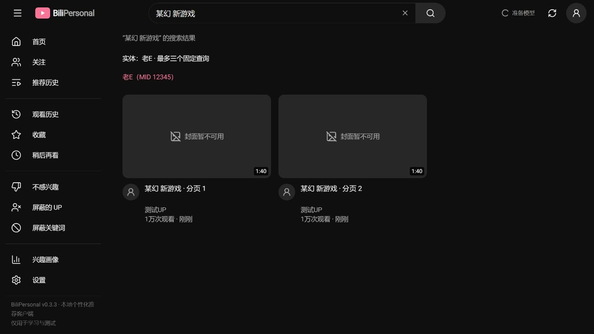

# v0.3.3 实施与验收

日期：2026-10-07。基础规则版本：`rules-v033.1`，即时控制快照：`controls-v033.1`。

## 实施范围

- 统一作者／明确主体同页及真实曝光跨页限制，生成、事务提交、缓存返回和库存模拟共用限制；晚到曝光只影响后续返回。
- 90 天可信常看资格、北京时间跨日、收藏用途、全历史已看过滤；Related 弱种子一次成功、常看旧种子每日重试、失败不消费。耗尽档案每日检查最新页，保留深翻断点。
- 详情补全有进展时清除提前退出留下的退避；保留每轮 15／12／3 次及每小时 240／40 次请求预算。
- 新鲜度及两类扩展独立生效，批次冻结设置、模型和词典；分类在限额前完成，关闭扩展不通过其他来源绕过。
- 人工实体词典、保守最长名称识别、账号绑定、歧义选择、三个固定复合查询、独立分页、BV 去重、失败重试和会话过期。
- 后台准备快照与前台可见性轮询，空页恢复幂等、短页稳定；历史冻结诊断、库存估计、失效试用不再阻塞互斥、盲评公共控制快照。

## 接口

- `/api/v1/system/recommendation-settings`：保留旧字段局部更新，增加 `freshness`、`discovery`、`third_party`；并发局部更新在 SQLite 事务内合并。
- `/api/v1/user/entities`：GET／PUT，字典版本用于冲突检查；稳定实体 ID，类型 `up/character/work`，人工 MID 绑定。
- `/api/v1/feed/readiness?stream_id=…`：`status`、`version`、`available`、`complete_pages`、`at_least`、`retry_at`；前台读取不评分、不访问 B 站。
- `/api/v1/search`：保留普通数字 `page`；增加 `entity_id`、`cursor`、`next_cursor`、`retry_cursor`、`has_more`、`entity_choices`。URL、标题和搜索记忆保留原始查询。

## 自动验证

完整后端发现式回归：146 项通过。该轮运行期间随后收紧了局部设置事务、缓存已看过滤、经典首页新鲜度分组和单次垂类召回冻结，因此额外执行以下验证：

- `backend.tests.test_v033`：24 项通过，含新增并发局部保存、词典冻结及搜索会话过期、历史归因与年龄冻结、缓存新发生已看过滤。
- 经典来源内部排序、旧批次模型固定、warmup、后台常看调度、关闭来源：5 项通过。
- 垂类独立开关、分页失败退避及经典排序：3 项通过，包含第 25 个 v0.3.3 用例。
- 非法档位类型、并发局部保存和三个短中文名称负例的最终定向检查：2 项通过。
- `node tests/telemetry.cjs`：5 个曝光／点击计时及重试场景通过。
- `node tests/recovery.cjs`：7 个空页恢复、短页稳定、隐藏暂停、手动换批互斥、有效响应后停止及丢失响应复用 view_id 场景通过。
- `npm run build`：TypeScript 与生产构建通过。
- `git diff --check`：通过。

复现主要检查（项目根目录；前端命令在 `frontend` 目录）：

```powershell
.\.venv\Scripts\python.exe -W ignore -m unittest discover -s backend/tests -p 'test*.py' -v
.\.venv\Scripts\python.exe -W ignore -m unittest backend.tests.test_v033 -v
```

```powershell
node tests/telemetry.cjs
node tests/recovery.cjs
npm run build
```

后端测试使用临时 SQLite 和假接口。Windows 受限沙箱曾导致临时目录 SQLite 访问／清理失败，确认后在批准的权限范围运行测试；不把该环境失败计为规则验证结果。部分旧测试原先使用无日期收藏作为常看夹具，已补真实日期；原断言涉及同页两条同 UP 的地方按新上限更新。

## 浏览器验收

使用临时数据库、本机 8346 端口、假登录账号和假搜索结果，阻断真实远端请求；未操作真实账户和数据库。

- 首页生成与曝光上报正常；推荐流和热门关闭后相应导航隐藏。
- 新鲜度和新作者档位无需旧试用即可保存，重载后保留。
- 实体新增、编辑、MID 绑定及删除生效；同名别名提示保留多义。
- 复合输入保留剩余词，显示所选实体及绑定账号；分页相同 BV 去重。
- 多义输入先展示选择页；选择后 URL 和页面标题继续保留原始查询。
- 7／30 天切换显示生成量、可见曝光、重复率、新鲜度和实体证据。



浏览器验收使用受控假数据；远端风控、长时间真实使用下的供给和推荐收益仍需真实运行观察。新鲜度参数没有经过收益实验，不宣称提升。

## 兼容与交付

不重训模型，不新增依赖，不修改编辑器／项目配置，不执行真实数据库迁移。保留原 `source_scheduler.py` 与 `test_v032.py` 未提交修改，以及原问题清单。旧历史、模型、主题别名格式及盲评试用门槛保留。此次交付为工作区修改，未提交或发布。
